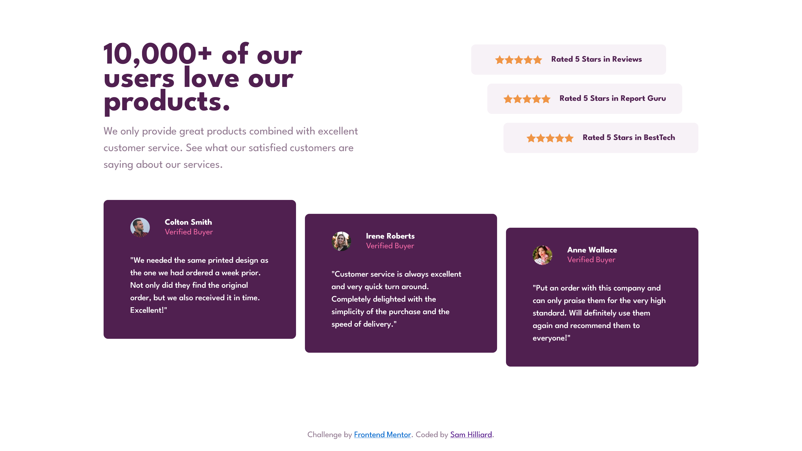

# Frontend Mentor - Social proof section solution

This is a solution to the [Social proof section challenge on Frontend Mentor](https://www.frontendmentor.io/challenges/social-proof-section-6e0qTv_bA). Frontend Mentor challenges help you improve your coding skills by building realistic projects. 

## Table of contents

- [Frontend Mentor - Social proof section solution](#frontend-mentor---social-proof-section-solution)
  - [Table of contents](#table-of-contents)
  - [Overview](#overview)
    - [The challenge](#the-challenge)
    - [Screenshot](#screenshot)
    - [Links](#links)
  - [My process](#my-process)
    - [Built with](#built-with)
    - [What I learned](#what-i-learned)
    - [Useful resources](#useful-resources)
  - [Author](#author)
  - [Acknowledgments](#acknowledgments)

**Note: Delete this note and update the table of contents based on what sections you keep.**

## Overview

### The challenge

Users should be able to:

- View the optimal layout for the section depending on their device's screen size

### Screenshot

### Links

- Solution URL: [github repo](https://github.com/sam-hilliard/social-proof-section)
- Live Site URL: [live site](https://sam-hilliard.github.io/social-proof-section/)

## My process

I first layed out the HTML and planned my class names. Then, linked a stylesheet with all of the
colors from the style-guide declared as variables. I also did my normal CSS resets and started by
coloring and getting the typography in order. Then I focused on the mobile layout (I strictly believe
in mobile-first implementation as it's easier to start with and adapt a more complex layout to). Then,
I created the necessary changes for the desktop layout.

### Built with

- Flexbox
- CSS Grid
- Mobile-first workflow

### What I learned

This challenge proved an excellent practice for layouts created by flex box and grid. I struggled
a lot with getting the layout as close to the design as possible so I learned a lot in the process :).

Specifically, I gained more of an understaning of when to use flexbox vs grid after playing around with
both. I also gained a more solid understanding of alignment properties of flexbox.

Bottom line: Use grid for layouts in general and flexbox when you need to align things better within the
grid (unless you can do the aligning with the grid as well). This is just my take after this experience.

### Useful resources

- [Flexbox alignment](https://developer.mozilla.org/en-US/docs/Web/CSS/CSS_Flexible_Box_Layout/Aligning_Items_in_a_Flex_Container) - This article gave me a refresher on how to control alignment along both axises of a flex container.

## Author

- Website - [Sam Hilliard](https://sam-hilliard.github.io/)
- Frontend Mentor - [@samhill15](https://www.frontendmentor.io/profile/samhill15)

## Acknowledgments

As always, thanks to [Kevin Powell](https://www.kevinpowell.co/) for supplying fantastic YouTube
content that keeps me motivated in learning and practicing front-end development.
